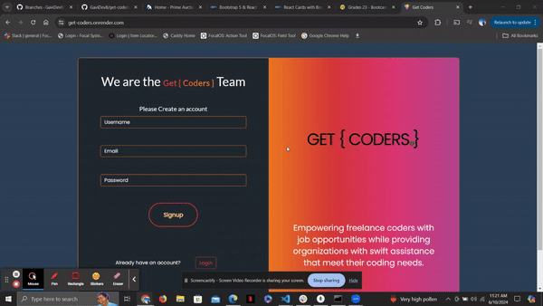

# 👩🏽‍💻 🛠️ Get-Coders 🛠️ 👩🏽‍💻
The contract coders live link: https://get-coders.onrender.com/

## Description

Welcome to Get-Coders! A user-friendly tool designed to empower freelance coders with job opportunities while providing organizations with swift assistance that meet their coding needs.

Experience the efficiency of Get-Coders by effortlessly sharing your coding opportunities and receiving swift responses from our talented pool of freelance coders. Let us streamline your hiring process so you can focus on what truly matters—building exceptional projects.

## Project Purpose
Get-Coders is a sophisticated bid management system tailored specifically for contract work. With its intuitive interface, our platform allows you to seamlessly manage your job-seeking endeavors or short-term projects. Join us today and unlock a wealth of opportunities in the ever-evolving world of coding.

Key Features:
1. Personal Account Login: Securely access your personalized account to jobs or posted jobs
2. Comprehensive Job Search: Explore a vast amount of different type of jobs
3. Bid: Easily bid for your preferred job and watch live if accepted
4. Post a Job: Accelerate your hiring process with swift responses

Future Features:
1. Personalize your profile section a bit more
2. Review system
3. Login with a QR code
4. Make available in app store for mobile use

## Lessons Learned
Through working on this project, we gained a great understanding of our coding, team collaboration and data manipulation. Improved skills in HTML, CSS, JS, React, Apollo, MongoDB, Mongoose, Render, Project Management and team collaboration.

## Tech-Stack
Languages and other: HTML, CSS, Javascript, React, MondoDB, Mongoose 
Dependencies: apollo, react-bootstrap, graphql, happy-dom, jwt-decode, react, react-dom, react-icons, react-router-dom

## Installation 
1. Clone Git Repo
2. Install all dependencies - npm i
3. Edit folder structure and data to your personal preference